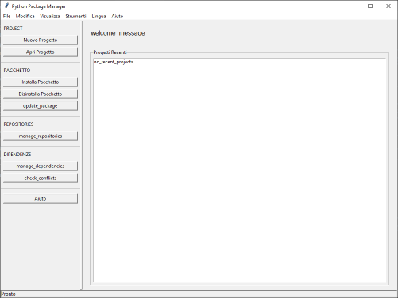

# Python Package Manager GUI

[](https://github.com/Nsfr750/pack/releases/tag/v1.2.0)
[](https://www.python.org/)
[](https://www.gnu.org/licenses/gpl-3.0)
[](https://github.com/Nsfr750/pack/graphs/commit-activity)
[](https://github.com/psf/black)
[](https://github.com/Nsfr750/pack/actions)
[](https://codecov.io/gh/Nsfr750/pack)

A modern, user-friendly GUI application built with CustomTkinter for managing Python packages. 
Streamline your Python package development workflow with an intuitive interface.



## ✨ Features

### 🚀 Package Management

- 🏗️ **Initialize** new Python packages with customizable templates
- 🔧 **Build** source distribution and wheel packages with a single click
- ⚡ **Install** packages in development mode with automatic dependency handling
- ☁️ **Upload** packages to PyPI with secure credential management
- 🔍 **Search** and manage installed packages
- 📦 **Dependency** resolution and management

### 🛠️ Development Tools

- 📝 **Help System** with tabbed interface and search
- 📊 **Real-time Logging** with console output
- 🧪 **Testing** integration with pytest
- ✅ **Code Quality** checks with flake8 and mypy
- 🖥️ **Integrated Terminal** for command-line access
- 🔄 **Auto-formatting** with Black and isort

### 🎨 User Experience

- 🌍 **Multi-language** support (English/Italian)
- 🎨 **Themes** with light/dark mode support
- ⌨️ **Keyboard Shortcuts** for power users
- 🔄 **Auto-update** checking
- 📚 **Comprehensive** in-app documentation
- 🚦 **Status Bar** with useful information

## 🚀 Getting Started

### Prerequisites

- Python 3.8 or higher
- pip (latest version recommended)
- Git (for version control integration)
- Tcl/Tk (usually included with Python)

### Installation

#### From PyPI (Recommended)


```bash
pip install python-package-manager
```

#### From Source

1. **Clone the repository**:

   ```bash
   git clone https://github.com/Nsfr750/pack.git
   cd pack
   ```

2. **Create and activate a virtual environment** (recommended):

   ```bash
   # Windows
   python -m venv venv
   .\venv\Scripts\activate
   
   # Unix/macOS
   python3 -m venv venv
   source venv/bin/activate
   ```

3. **Install dependencies**:

   ```bash
   pip install -e ".[dev]"
   ```

## 🏃‍♂️ Usage

### Running the Application

```bash
python -m pack
```

### Basic Workflow

1. **Project Setup**
   - Click `File > New Project` or `Open Project`
   - Configure package metadata in the settings
   - Initialize a new package or open an existing one

2. **Development**
   - Edit your package code in your preferred editor
   - Use the built-in terminal for commands
   - Check logs in the console tab

3. **Building & Distribution**
   - Click `Build` to create distributions
   - Install in development mode with `Install`
   - Upload to PyPI when ready

## 🛠️ Development

### Project Structure

```text
pack/
├── struttura/         # Core application modules
│   ├── __init__.py
│   ├── main.py         # Main application entry point
│   ├── ui/             # UI components
│   ├── utils/          # Utility functions
│   └── resources/      # Resources and assets
├── tests/             # Test suite
├── docs/              # Documentation
├── examples/          # Example projects
└── requirements.txt   # Dependencies
```

### Running Tests

```bash
# Run all tests
pytest

# Run with coverage report
pytest --cov=pack tests/

# Generate HTML coverage report
coverage html
```

### Building the Application

```bash
# Build source distribution
python -m build --sdist

# Build wheel
python -m build --wheel
```

## 🤝 Contributing

Contributions are welcome! Please read our [Contributing Guidelines](CONTRIBUTING.md) for details on how to get started.

1. Fork the repository
2. Create a feature branch (`git checkout -b feature/amazing-feature`)
3. Commit your changes (`git commit -m 'Add some amazing feature'`)
4. Push to the branch (`git push origin feature/amazing-feature`)
5. Open a Pull Request

## 📄 License

This project is licensed under the GPL-3.0 License - see the [LICENSE](LICENSE) file for details.

## 🙏 Acknowledgments

- [CustomTkinter](https://github.com/TomSchimansky/CustomTkinter) for the amazing UI framework
- [PyPI](https://pypi.org/) for package hosting
- All contributors who have helped improve this project

---

Made with ❤️ by the Python Package Manager Team
├── gui/               # GUI components
├── tests/             # Test suite
├── main.py            # Application entry point
└── requirements.txt   # Project dependencies
```

### Running Tests

```bash
pytest tests/
```

### Code Style

This project uses:

- Black for code formatting
- Flake8 for linting
- Type hints throughout the codebase

## 🤝 Contributing

Contributions are welcome! Please read our [Contributing Guidelines](CONTRIBUTING.md) for details.

## 📄 License

This project is licensed under the GPLv3 License - see the [LICENSE](LICENSE) file for details.

## 🙏 Acknowledgments

- Built with ❤️ using Python and CustomTkinter
- Inspired by the needs of Python package maintainers
- Thanks to all contributors who have helped improve this project
